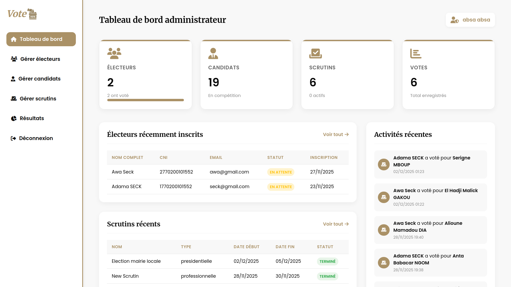
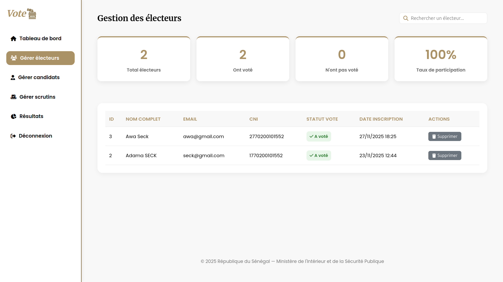

# 🗳️ Plateforme de Vote Électronique

Projet de **Système de Vote Électronique** permettant l’organisation de scrutins, la gestion des électeurs et candidats, le vote sécurisé, et l’affichage automatique des résultats avec désignation du gagnant.

---

## 📌 Fonctionnalités principales

### 👥 Authentification & Rôles

* Connexion sécurisée (sessions PHP)
* Rôles supportés :

  * `admin`
  * `electeur`
* Protection des pages par rôle

### 🗳️ Gestion des Scrutins

* Création de scrutins
* Définition des dates de début et fin
* Statut automatique (`en_cours`, `termine`)
* Liaison candidats ↔ scrutins

### 👤 Gestion des Candidats

* Ajout et modification des candidats
* Photo officielle
* Parti politique

### 🗳️ Vote Sécurisé

* Un seul vote par électeur par scrutin
* Enregistrement sécurisé en base
* Historique des votes

### 📊 Résultats Automatiques

* Comptage automatique des votes
* Classement des candidats
* Affichage du **gagnant officiel** dès la fin du scrutin
* Export PDF des résultats

---

## 🏆 Affichage automatique du gagnant

Le gagnant est calculé automatiquement lorsque :

* Le statut du scrutin est `termine`
* Des votes existent

Critère : **candidat avec le plus grand nombre de votes**.

---

## 🛠️ Technologies utilisées

### Backend

* PHP 8+
* MySQL 
* PDO (sécurisation SQL)

### Frontend

* HTML5
* CSS3 (UI moderne)
* JavaScript
* FontAwesome

### Sécurité

* Sessions PHP
* Protection XSS (`htmlspecialchars`)
* Requêtes préparées PDO

---

## 📂 Structure du projet

```
vote/
│
├── assets/
│   ├── css/
│   ├── img/
│   │   └── candidats/
│   ├── js/
│   ├── programmes/
│
├── config/
│   └── database.php
│
├── controllers/
│   ├── auth.php
│   ├── logout.php
│   └── vote.php
│
├── lib/
│   ├── animate/
│   ├── easing/
│   ├── isotope/
│   ├── owlcarousel/
|
├── models/
│   └── Candidat.php
│   └── User.php
│   └── Vote.php
|
├── views/
│   ├── auth/
│   ├── admin/
│   └── electeur/
│   └── home/
│
└── index.php
```
## Captures d'écran du projet

Voici quelques captures de l'application :







> Les fichiers complets se trouvent dans `assets/screenshots/`

---

## ⚙️ Installation

### 1️⃣ Cloner le projet

```bash
git clone https://github.com/Adam01-i/Plateforme-Vote-lectronique.git
cd vote-electroniquePlateforme-Vote-lectronique

### 2️⃣ Configurer la base de données

-- --------------------------------------------------
-- Base de données : vote
-- --------------------------------------------------
CREATE DATABASE IF NOT EXISTS vote;
USE vote;

-- --------------------------------------------------
-- Table Candidat
-- --------------------------------------------------
CREATE TABLE IF NOT EXISTS Candidat (
    id INT AUTO_INCREMENT PRIMARY KEY,
    prenom VARCHAR(100) NOT NULL,
    nom VARCHAR(100) NOT NULL,
    parti_politique VARCHAR(100) NOT NULL,
    photo_officiel VARCHAR(255),
    programme VARCHAR(255),
    date_creation TIMESTAMP DEFAULT CURRENT_TIMESTAMP
);

-- --------------------------------------------------
-- Table Scrutin
-- --------------------------------------------------
CREATE TABLE IF NOT EXISTS Scrutin (
    id INT AUTO_INCREMENT PRIMARY KEY,
    nom VARCHAR(255) NOT NULL,
    type VARCHAR(100) NOT NULL,
    description TEXT,
    date_debut DATETIME NOT NULL,
    date_fin DATETIME NOT NULL,
    statut ENUM('en_attente','en_cours','termine') DEFAULT 'en_attente',
    date_creation TIMESTAMP DEFAULT CURRENT_TIMESTAMP
);

-- --------------------------------------------------
-- Table Scrutin_Candidat
-- --------------------------------------------------
CREATE TABLE IF NOT EXISTS Scrutin_Candidat (
    scrutin_id INT NOT NULL,
    candidat_id INT NOT NULL,
    PRIMARY KEY(scrutin_id, candidat_id),
    FOREIGN KEY (scrutin_id) REFERENCES Scrutin(id) ON DELETE CASCADE,
    FOREIGN KEY (candidat_id) REFERENCES Candidat(id) ON DELETE CASCADE
);

-- --------------------------------------------------
-- Table Utilisateur
-- --------------------------------------------------
CREATE TABLE IF NOT EXISTS Utilisateur (
    id INT AUTO_INCREMENT PRIMARY KEY,
    nom VARCHAR(100) NOT NULL,
    prenom VARCHAR(100) NOT NULL,
    cni VARCHAR(50) NOT NULL UNIQUE,
    email VARCHAR(255) NOT NULL UNIQUE,
    mdp VARCHAR(255) NOT NULL,
    role ENUM('electeur','admin') DEFAULT 'electeur',
    date_creation TIMESTAMP DEFAULT CURRENT_TIMESTAMP
);

-- --------------------------------------------------
-- Table Vote
-- --------------------------------------------------
CREATE TABLE IF NOT EXISTS Vote (
    id INT AUTO_INCREMENT PRIMARY KEY,
    utilisateur_id INT NOT NULL,
    candidat_id INT NOT NULL,
    scrutin_id INT NOT NULL,
    date_et_heure TIMESTAMP DEFAULT CURRENT_TIMESTAMP,
    FOREIGN KEY (utilisateur_id) REFERENCES Utilisateur(id),
    FOREIGN KEY (candidat_id) REFERENCES Candidat(id),
    FOREIGN KEY (scrutin_id) REFERENCES Scrutin(id)
);


-- --------------------------------------------------
-- Vues
-- --------------------------------------------------
 -- Vue deja_vote CREATE OR REPLACE VIEW deja_vote AS
    SELECT utilisateur_id, scrutin_id, COUNT(*) AS nb_votes
    FROM Vote
    GROUP BY utilisateur_id, scrutin_id;
-- Vue participation
CREATE OR REPLACE VIEW vue_participation_scrutin AS
SELECT 
    s.id AS scrutin_id,
    s.nom AS nom_scrutin,
    COUNT(v.id) AS nb_votants,
    (SELECT COUNT(*) FROM Utilisateur WHERE role='electeur') AS nb_total_electeurs,
    ROUND(COUNT(v.id)/(SELECT COUNT(*) FROM Utilisateur WHERE role='electeur')*100,2) AS taux_participation
FROM Scrutin s
LEFT JOIN Vote v ON v.scrutin_id = s.id
GROUP BY s.id, s.nom;

-- Vue résultats
CREATE OR REPLACE VIEW vue_resultats_scrutin AS
SELECT 
    s.id AS scrutin_id,
    s.nom AS nom_scrutin,
    c.id AS candidat_id,
    CONCAT(c.prenom,' ',c.nom) AS nom_candidat,
    c.parti_politique,
    COUNT(v.id) AS nombre_votes
FROM Scrutin s
JOIN Scrutin_Candidat sc ON sc.scrutin_id = s.id
JOIN Candidat c ON c.id = sc.candidat_id
LEFT JOIN Vote v ON v.candidat_id = c.id AND v.scrutin_id = s.id
GROUP BY s.id, s.nom, c.id, c.prenom, c.nom, c.parti_politique;

-- Vue scrutins avec nombre de candidats
CREATE OR REPLACE VIEW vue_scrutins_avec_candidats AS
SELECT 
    s.id AS scrutin_id,
    s.nom AS nom_scrutin,
    s.type,
    s.description,
    s.date_debut,
    s.date_fin,
    s.statut,
    COUNT(sc.candidat_id) AS nb_candidats
FROM Scrutin s
LEFT JOIN Scrutin_Candidat sc ON sc.scrutin_id = s.id
GROUP BY s.id, s.nom, s.type, s.description, s.date_debut, s.date_fin, s.statut;

-- Vue votes par utilisateur
CREATE OR REPLACE VIEW vue_votes_utilisateur AS
SELECT 
    u.id AS utilisateur_id,
    CONCAT(u.prenom,' ',u.nom) AS nom_utilisateur,
    s.nom AS scrutin,
    CONCAT(c.prenom,' ',c.nom) AS candidat_vote,
    v.date_et_heure
FROM Utilisateur u
JOIN Vote v ON v.utilisateur_id = u.id
JOIN Scrutin s ON s.id = v.scrutin_id
JOIN Candidat c ON c.id = v.candidat_id;


-- Index pour les recherches rapides sur les utilisateurs
CREATE INDEX idx_utilisateur_email ON Utilisateur(email);
CREATE INDEX idx_utilisateur_cni ON Utilisateur(cni);

-- Index pour les candidats
CREATE INDEX idx_candidat_nom ON Candidat(nom);
CREATE INDEX idx_candidat_parti ON Candidat(parti_politique);

-- Index pour les scrutins
CREATE INDEX idx_scrutin_statut ON Scrutin(statut);
CREATE INDEX idx_scrutin_date ON Scrutin(date_debut, date_fin);

-- Index pour les votes
CREATE INDEX idx_vote_scrutin ON Vote(scrutin_id);
CREATE INDEX idx_vote_candidat ON Vote(candidat_id);
CREATE INDEX idx_vote_utilisateur ON Vote(utilisateur_id);

-- Index sur la table de liaison
CREATE INDEX idx_scrutin_candidat_scrutin ON Scrutin_Candidat(scrutin_id);
CREATE INDEX idx_scrutin_candidat_candidat ON Scrutin_Candidat(candidat_id);


-- Vider la table si nécessaire
-- TRUNCATE TABLE Candidat;

INSERT INTO Candidat (prenom, nom, parti_politique, photo_officiel, programme) VALUES
('Boubacar', 'CAMARA', 'Parti de la Solution', 'boubacar_camara.jpg', 'boubacar_camara.pdf'),
('Alioune Mamadou', 'DIA', 'Alliance pour la République', 'aliou_dia.jpg', 'aliou_dia.pdf'),
('Aly Ngouille', 'NDIAYE', 'Union pour le Progrès', 'aly_ndiaye.jpg', 'aly_ndiaye.pdf'),
('Amadou', 'BA', 'Coalition BBY', 'am_ba.jpg', 'am_ba.pdf'),
('Anta Babacar', 'NGOM', 'Alternative pour le Développement', 'anta.jpg', 'anta.pdf'),
('Mahammed Boun Abdallah', 'DIONE', 'Mouvement Citoyen', 'abdallah_dione.jpg', 'abdallah_dione.pdf'),
('Cheikh Tidiane', 'DIEYE', 'Parti de l''Émergence', 'tidjiane_dieye.jpg', NULL),
('Daouda', 'NDIAYE', 'Alliance Démocratique', 'daouda_ndiaye.jpg', 'daouda_ndiaye.pdf'),
('Dethie', 'FALL', 'Union pour la Renaissance', 'dethie_fall.jpg', 'dethie_fall.pdf'),
('Bassirou Diomaye Diakhar', 'FAYE', 'Pastef / Les Patriotes', 'diomaye.jpg', 'diomaye.pdf'),
('Habib', 'SY', 'Mouvement Républicain', 'habib_sy.jpg', NULL),
('Idrissa', 'SECK', 'Rewmi', 'idy.jpg', 'idy.pdf'),
('Khalifa Ababacar', 'SALL', 'Taxawu Sénégal', 'khalifa.jpg', 'khalifa.pdf'),
('Mamadou Lamine', 'DIALLO', 'Parti de l''Unité Nationale', 'lamine_diallo.jpg', 'lamine_diallo.pdf'),
('El Hadji Mamadou', 'DIAO', 'Mouvement Populaire', 'mamadou_diao.jpg', 'mamadou_diao.pdf'),
('El Hadji Malick', 'GAKOU', 'Alliance pour le Changement', 'gakou.jpg', 'gakou.pdf'),
('Pape Djibril', 'FALL', 'Rassemblement Démocratique', 'djibril.jpg', 'djibril.pdf'),
('Serigne', 'MBOUP', 'Union des Forces Progressistes', 'mboup.jpg', NULL),
('Thierno Alassane', 'SALL', 'Mouvement de la Renaissance', 'thierno_sall.jpg', 'thierno_sall.pdf');


### 3️⃣ Configurer la connexion DB

Modifier `config/database.php` :

```php
$host = "localhost";
$dbname = "vote_db";
$username = "root";
$password = "";
```

### 4️⃣ Lancer le serveur

```bash
php -S localhost:8000
```

Accéder à :

```
http://localhost:8000/vote
```

---

## 👤 Comptes de test (exemple)

| Rôle     | Email                                         | Mot de passe |
| -------- | --------------------------------------------- | ------------ |
| Admin    | [admin@vote.com](mailto:admin@vote.com)       | admin123     |
| Électeur | [electeur@vote.com](mailto:electeur@vote.com) | electeur123  |

---

## 📊 Exemple de logique gagnant (PHP)

```php
$total_votes = array_sum(array_column($candidats, 'votes_obtenus'));
$gagnant = ($total_votes > 0) ? $candidats[0] : null;
```

---

## 📤 Export des résultats

* Génération PDF par scrutin
* Accessible uniquement si des votes existent

---

## 🧪 Sécurité & Bonnes pratiques

* Requêtes préparées
* Validation des sessions
* Protection contre injection SQL
* Contrôle des rôles utilisateurs

---

## 🚀 Améliorations possibles

* 🔐 Double authentification
* 📱 Version mobile responsive
* 📊 Statistiques avancées (graphiques)
* 🔔 Notifications fin de scrutin
* 🧠 Audit & journalisation des actions

---

## 👨‍💻 Auteur

**Nom :** *Adama Seck*
**Université / Projet :** *Plateforme-Vote-lectronique.git
**Pays :** Sénégal 🇸🇳

---

## 📜 Licence

Projet open‑source — utilisation libre à des fins éducatives.

---

## ⭐ Astuce GitHub

Après publication :

```bash
git init
git add .
git commit -m "Initial commit"
git branch -M main
git remote add origin hhttps://github.com/Adam01-i/Plateforme-Vote-lectronique.git
git push -u origin main
